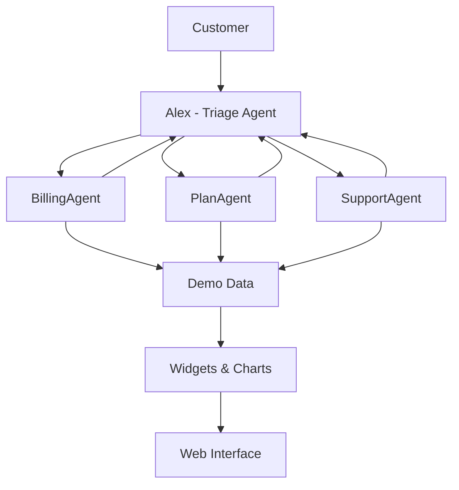
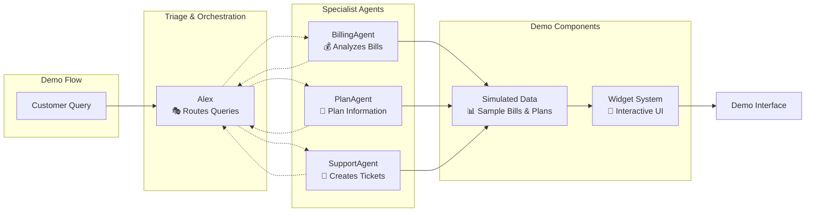
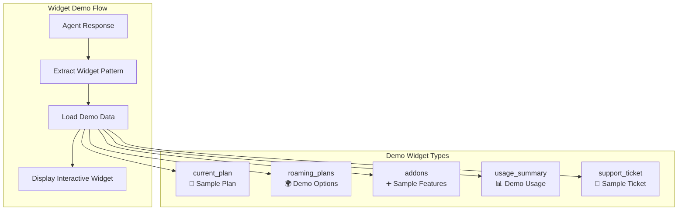
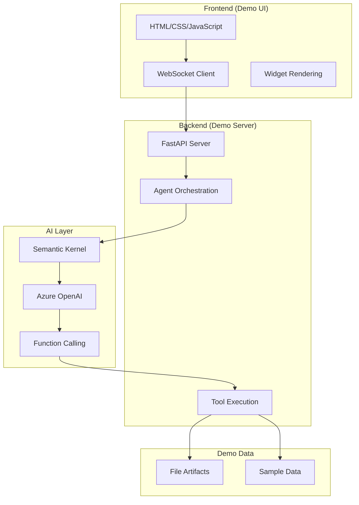

# Contoso AI Agent Demo
## Multi-Agent Customer Service Architecture

**This is a demonstration using simulated data for educational purposes.**

---

## 🎯 Demo Overview

**Multi-Agent Architecture** demonstration showing:
- **4 Specialized AI Agents** working together
- **Real-time agent coordination** with handoffs
- **Tool integration** for data analysis
- **Interactive widgets** showing agent outputs



---

## 🤖 Agent Architecture & Handoff Flow

**How agents coordinate to handle customer queries**



**Demo Features:**
- 🔄 **Agent handoffs** based on query type
- 📝 **Context preservation** across transfers
- 🎯 **Specialized responses** from each agent
- ⚡ **Real-time tool usage** visibility

---

## 💰 BillingAgent - Bill Analysis

**Demonstrates billing analysis with simulated data**

### Available Tools

| Tool | Purpose | Demo Output |
|------|---------|-------------|
| `get_recent_bills()` | Bill trend analysis | 📊 Charts with sample data |
| `analyze_high_charges()` | Identify unusual charges | 🔍 Simulated roaming/international charges |
| `get_bill_details()` | Detailed breakdown | 📋 CSV export with line items |
| `calculate_bill_item()` | Basic calculations | 🧮 Simple math operations |

### Demo Capabilities

**📊 Visual Analysis:**
- Creates charts showing billing trends from sample data
- Identifies simulated high charges (e.g., "roaming in USA")
- Generates CSV files with detailed breakdowns

**Example Demo Response:**
*"Your November bill was £201.78 vs usual £57.50 due to simulated roaming charges of £89.50"*

---

## 📱 PlanAgent - Plan Information

**Shows plan recommendations using demo data**

### Available Tools

| Tool | Purpose | Demo Output |
|------|---------|-------------|
| `get_current_plan()` | Current plan details | 📊 Sample plan information |
| `get_roaming_plans()` | Travel options | 🌍 Demo roaming plans |
| `get_available_addons()` | Additional features | ➕ Sample addon options |
| `get_usage_summary()` | Usage information | 📈 Simulated usage data |
| `check_feature_inclusion()` | Feature lookup | ✅ Plan feature checks |

### Demo Capabilities

**🌍 Plan Recommendations:**
- Shows sample roaming plans for different destinations
- Displays simulated usage against plan allowances
- Suggests demo addons based on usage patterns

---

## 🎫 SupportAgent - Ticket Creation

**Demonstrates escalation to human support**

### Available Tools

| Tool | Purpose | Demo Output |
|------|---------|-------------|
| `create_support_ticket()` | Ticket creation | 🎯 Sample support tickets |
| `get_widget_link()` | Action links | 🔗 Demo self-service links |

### Demo Capabilities

**🎫 Ticket Management:**
- Creates sample support tickets with context
- Generates demo callback scheduling
- Provides simulated priority classifications

---

## 🎨 Widget System - Interactive Display

**Shows how agents can provide structured data**



**Widget Benefits:**
- 🎯 **Structured data display** instead of text-only responses
- 🔄 **Interactive elements** for better user experience
- 📊 **Visual representation** of agent tool outputs

---

## 🚀 Technical Implementation

**Demo technology stack**



### Demo Stack
- **Frontend**: Vanilla JavaScript with WebSocket
- **Backend**: FastAPI with real-time updates
- **AI**: Microsoft Semantic Kernel + Azure OpenAI
- **Data**: Simulated customer data in Python

---

## 🎯 Demo Scenarios

### Scenario 1: Bill Analysis
**Customer Query:** *"Why is my bill high?"*

**Demo Journey:**
1. 🎭 Alex routes to BillingAgent
2. 📊 Creates chart from sample billing data
3. 🔍 Identifies simulated high charges (e.g., roaming)
4. 📋 Provides downloadable CSV with details

### Scenario 2: Travel Planning
**Customer Query:** *"I need a roaming plan for Europe"*

**Demo Journey:**
1. 🎭 Alex routes to PlanAgent
2. 🌍 Shows demo Europe roaming options
3. 💰 Displays sample pricing comparisons
4. 🔗 Provides simulated activation options

### Scenario 3: Support Escalation
**Customer Query:** *"I want to speak to someone"*

**Demo Journey:**
1. 🎭 Alex routes to SupportAgent
2. 🎫 Creates sample support ticket
3. 📝 Shows conversation context preservation
4. ⏰ Displays demo callback scheduling

---

## 🔧 Running the Demo

### Terminal Version
```bash
cd ui/backend
python handoff_demo.py
```
- Shows pure agent orchestration
- See tool usage in real-time
- Understand handoff patterns

### Web Interface
```bash
cd ui/backend
uvicorn main:app --host 0.0.0.0 --port 8000 --reload
```
- Full interactive web experience
- Visual widgets and charts
- Real-time agent communication

---

## 📝 Demo Notes

**What This Demo Shows:**
- Multi-agent coordination patterns
- Tool integration for data analysis
- Real-time agent handoffs
- Interactive data visualization

**What This Demo Uses:**
- Simulated customer data
- Sample billing information
- Demo plan and pricing data
- Mock integration points

**Technology Demonstrated:**
- Microsoft Semantic Kernel framework
- Azure OpenAI for natural language
- FastAPI for web services
- WebSocket for real-time updates

---

*Demo built with Microsoft Semantic Kernel | Azure OpenAI*